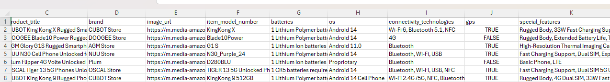
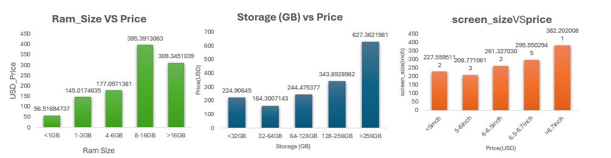
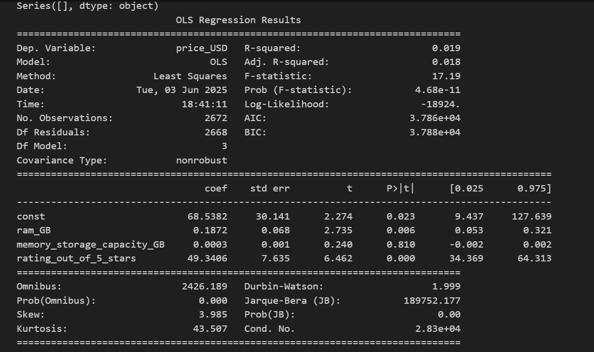
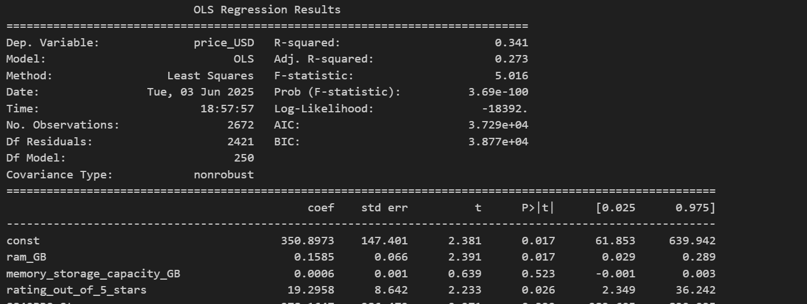
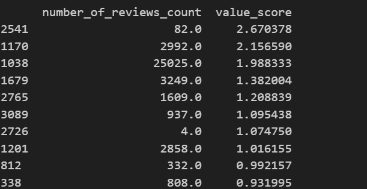
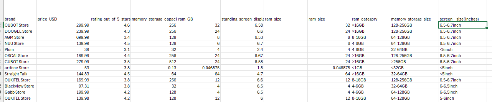

# 📱 Smartphone Pricing Analysis

This exploratory project analyzes over 1,000 smartphones listed on Amazon to answer a key question:
**What drives smartphone pricing more — technical specifications or brand power?**

---

## 🔍 Business Question

- How much do hardware specs influence smartphone prices?
- Is there a clear brand premium beyond specs?
- Are high-rated phones mainly from well-known brands?

---

## 📊 Dataset

- Source: Amazon Cell Phone Listings from Kaggle
- Sample Size: 1,000+ phones (Nov 2005 – May 2025)
- Key variables: RAM, Storage, Screen Size, Brand, Rating, Price

---

## 🧠 Methods

- Binning & Averaging (specs vs. price trends)
- Multivariate Regression (evaluate individual contribution)
- Value Score Construction: `(rating / price) * log(review_count + 1)`

---

## 📌 Key Findings

- RAM and rating show some correlation, but low explanatory power (R² = 0.019)
- After adding **brand dummy**, R² increases to 0.34 → brand matters much more
- Top “value-for-money” phones tend to be low-cost, niche brands
- High-rated phones are predominantly from Xiaomi, Samsung, Huawei → brand trust matters

---

## 🖼️ Key Visuals
👉 Click on the images to view full-size charts.
  
  






---
## 📁 Project Structure

```
smartphone-pricing-analysis/
├── 📁 charts/                      # All analysis visuals
│   ├── specs_vs_price.png
│   ├── regression_comparison.png
│   ├── value_score_ranking.png
│   └── high_rating_brands.png
│
├── 📁 data/                        # Cleaned dataset (zipped)
│   └── amazon_cellphone_cleaned.zip
│
├── 📁 presentation/               # Final PPT or PDF report
│   └── smartphone_pricing_ppt.pdf
│
├── 📄 README.md                   # Project summary
```
